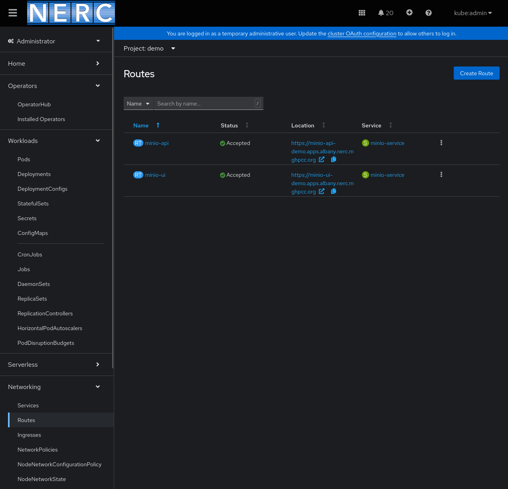
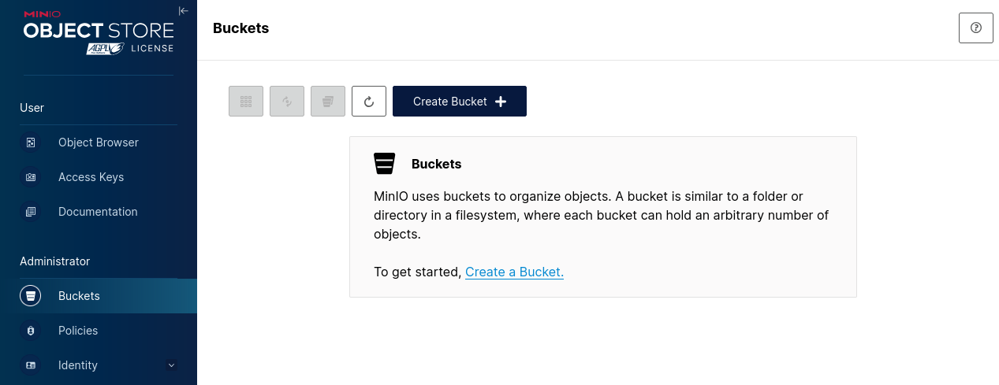
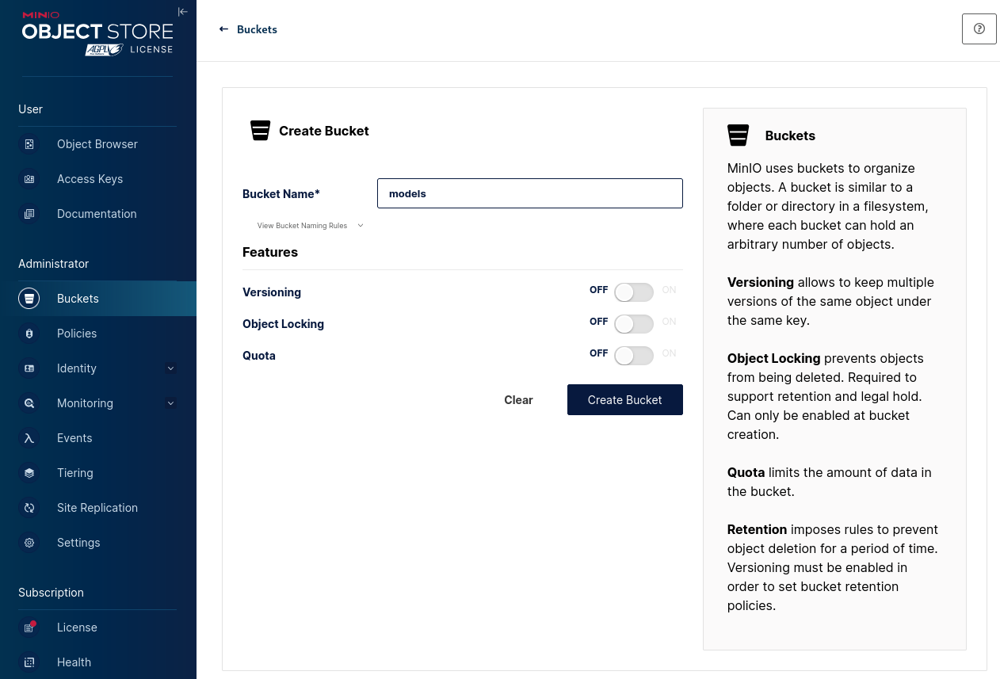
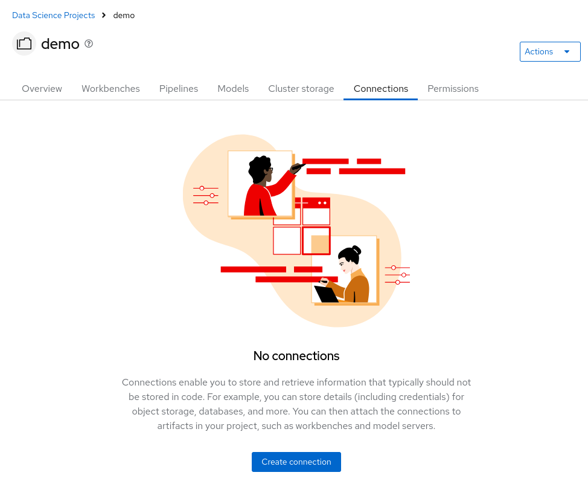

# Guide to Deploying AI Models on Red Hat OpenShift AI (RHOAI)

## Prerequisites 

A cluster that has been properly configured for model serving. If cluster is not yet properly configured follow the [Guide to Configuring RHOAI for Model Deployment](https://github.com/IsaiahStapleton/rhoai-config-guide)

## Purpose

The purpose for this guide is to offer the simplest steps for deploying an AI model on RHOAI. This guide will specifically be covering deploying the ***Granite Model*** using the ***vLLM ServingRuntime for KServe*** using a ***NVIDIA A100 GPU***. In addition to deploying the model, this guide will cover setting up a simple observability stack so that you can collect and visualize metrics related to AI model performance and GPU information.

## 1. Deploying S3 Storage using Minio 

## 2. Downloading Model 

Navigate to https://huggingface.co/ and find the model you would like to deploy. For this guide I am going to be downloading the granite-3.0-8b-instruct model (https://huggingface.co/ibm-granite/granite-3.0-8b-instruct/tree/main).

First you need to generate an access token:
1. Navigate to settings -> access tokens
2. Select create new token
3. For token type, select Read and then give it a name
4. Copy the token

Now that you have a token, you can download the model.

`git clone https://<user_name>:<token>@huggingface.co/<repo_path>`

For me this looks like

`git clone https://IsaiahS1:<token>@huggingface.co/ibm-granite/granite-3.0-8b-instruct`

## 3. Uploading the Model to the S3 Minio Storage

1. Assuming you followed the steps above to deploy minio storage, navigate to the minio UI, found in Networking -> routes within the openshift console.

2. Login with the credentials you specified in the minio deployment

3. Create a bucket, give it a name such as “Models”, select create bucket

4. Select your bucket from the object browser 

5. From within the bucket, select upload -> upload folder, and select the folder where the model was downloaded from huggingface. Wait for the upload to finish, this will take a while.

## 4. Deploying Model on Red Hat OpenShift AI

### 4.1. Create S3 Storage Data Connection

1. Within your data science project, navigate to connections and select create connection

2. Fill in the following values:
- Connection name: name of your data connection
- Access key: username of minio deployment
- Secret key: password for minio deployment
- Endpoint: endpoint of the minio deployment 
- Bucket: name of the minio bucket you created

### 4.2. Deploy your Model!

## 5. Setting up Observability Stack & Collecting Metrics